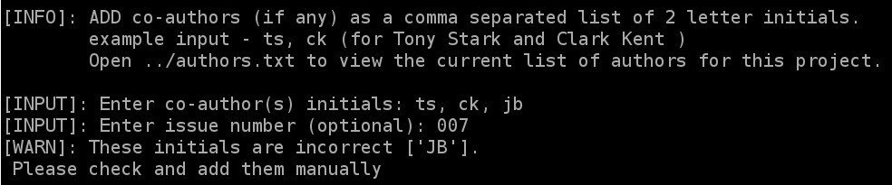
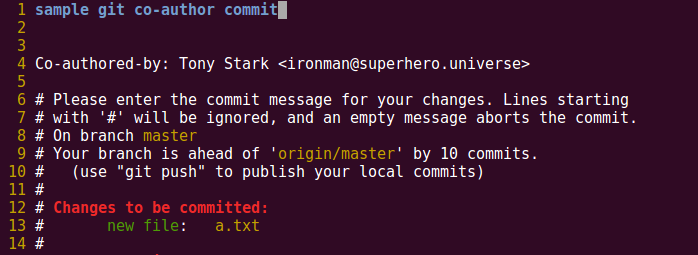

# git_coauthors
a simple git hook to add co-authors to commit message

* _prepare-commit-msg_ should be copied to each of the respective git repos i.e. \<git repo\>/.git/hooks
* run chmod +x prepare-commit-msg
* authors.lst should be in the parent directory of prepare-commit-msg hook. The authors should be in the following format:  
  \<initials\>: \<full name\>, \<email\>  
  a common domain is assumed. This can be configured in the script.

## screenshots
* input prompt - enter initials. co-author initials which aren't found are printed.

* how the commit message looks like after input prompt

