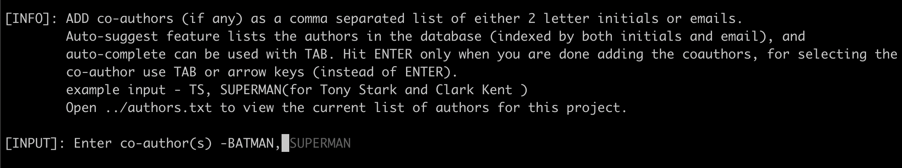

# git-coco (git hook for adding co-authors)
If you shied away from collaborative coding just because you had to manually add co-authors,
then this script will definitely calm your nerves. A simple git hook (in python3) to easily add co-authors to a commit
message. It gets triggered automatically as soon as you hit ```git-coco```. **coco** is short for "**co**mmit **co**authors".

Main features (TL; DR)-
* ```git-coco``` instead of ```git commit```
* Supports **Autcomplete** (keys - TAB, ↑, ↓) which enables you to remember other
important things instead of author details, and **Autosuggest** (key →) on top of this makes the process of adding repetitive 
co-author groups hassle free.
* Supports issue/task/item number as part of the commit message.

Check out the screenshots!

# Table of Contents
* [Setup](#Setup)
* [How to use](#how-to)
* [Configs](#configs)
* [Available git tags](#version-tags)
* [Extendable interface for programmers](#extendable-interface)
* [Why git-coco](#why-coco)

## Setup
Adapt ```config``` in ```utils.py``` accordingly (see [Configs](#configs)). Then,
1. ```./setup.sh``` - installs dependencies, updates ```$PATH```, and adds an environment variable ```GIT_COCO```
to bashrc. Restart your terminal after this step.
2. ```coco.sh install <absolute-path-to-your-git-repo>``` : this symlinks the 
git hooks to the git repo where you wanna use them. **This step should be done for each repo where you wanna use the hook.**
```coco.sh``` is in your ```$PATH```, so can be run from anywhere.

and you are good to go! Happy collaborative coding :)

**NOTE** - In the following cases, you should skip using the hook-
* amend - if you amend a commit message during an interactive rebase then the coauthor prompt will pop up again even if you had added them before. This is intentional. However, if you only change file(s) and do not wish to change the commit message during an amend then use 
```git commit --amend --no-edit```
* cherry pick - ```git cherry-pick <hash>``` triggers ```git commit``` by default, which then triggers the hook. Use ```git cherry-pick -n <hash>``` to avoid that.

### Uninstall
```coco.sh uninstall <absolute-path-to-your-git-repo>```: removes the git hooks
from the repo.

## How-to
* ```git-coco``` (**Autocomplete version**): Run ```git-coco``` or ```git-coco -m "<msg>"``` to see the hook in action.
 ```git-coco``` takes the same arguments as
```git commit```. With ```git-coco``` you can avail the cool autocomplete feature. Input can be either author's initials
 or their email ids. **Key bindings** - Select using ```TAB``` or ```up-arrow/down-arrow``` key.
 
 
  **Autosuggest** co-author groups - if a bunch of you repeatedly work together, then adding the same co-authors repeatedly from scratch is a hassle. You can make use
 of the autosuggest feature based on history to circumvent this. **Key bindings** - Select using ```right-arrow``` key.
 
  e.g. if Batman and Superman work together on multiple commits, then for the next commit you only need to type Batman. The autosuggest feature
 automatically suggests Superman which can be completed with the ```right-arrow``` key. The autosuggest feature works along with the above autocomplete
 feature.
 
 
* **Eidetic version**: If you forget to run ```git-coco``` and run ```git commit``` instead, then the autosuggest feature
will not work. However, you can still add the coauthors using initials only. Its eidetic because you gotta remember all the initials! :D

* ```git-add-authors```: to update ```authors.txt``` run ```git-add-authors```. It takes a list of authors
in the format specified in ```authors.txt```, i.e., ```<author-initials>: <author-full-name>, <author-email-id>```.
For example, ```git-add-authors "NR: Natasha Romanoff, black-widow" "KM: Krishna Mehra, krrish"```. 
Only unique initials can be added. The script takes care of checking if the initials are unique.

### Issue number (additional feature)
If you are using frameworks like jira or codebeamer for tracking tasks, then you can also add the corresponding task/issue number
to the commit message (check the screenshots). This can be done automatically if you name the branch ending with _issuexxxxx where xxxxx is the task number.
*The fundamental principle of this feature is to encourage one branch per issue*.
However, if your branch name does not contain the issue number then you will be prompted to enter it manually. This feature is an
example of how to add your own custom messages on top of co-authors (see for [Extendable interface](#extendable-interface) more details). 

##
How the final commit message looks like:


**NOTE** - Coauthors and issue number are optional, the committer can simply hit enter to ignore them.

## configs
The following variables under ```config``` in the script should be configured by the user:
### mutable (edit these)
* **domain** - the domain of your organization. e.g. gmail.com
* **issue_url_base** - if you are using frameworks like jira or codebeamer for tracking tasks,
                       then you can set the base url. Only one issue number per commit is supported currently. However, more can be manually added by amending the commit.
* **use_issue_in_msg** - set it to False if issue number in commit message is not needed. Default is True.

### immutable paths (preferably, edit only if necessary)
* **authors_file** - ```authors.txt``` usually is project specific and should reside in the parent directory
                                   of hooks. However, if several projects share the author list then this path can be
                                   accordingly adjusted.
* **coauthors_git_msg_file** - ```.coauthors.tmp``` is used to store the co-author message temporarily. This resides under the home directory.
* **history_file** - ```.git_coco_history``` is used to store the history of co-authors, resides under the home directory.


## Extendable Interface
If you want to add your own message type on top of coauthors (like the issue number) then,
1. simply add a custom class derived from ```CommitMessage``` in ```commit_message.py```.
You should override the property ```message``` which returns a string.
2. add a call to your custom class in ```fill_messages``` function in ```prepare-commit-msg```.
Your call should be under ```extend()``` at the appropriate place respecting the message format
as mentioned in the documenation of ```fill_messages```
3. Each custom class should have a flag variable under ```config``` in ```utils.py``` w.r.t useability. All config variables
 for this custom class should reside under its respective sub-dict, e.g., ```coauthors```, ```issue```.  

## Version Tags
Latest version is always the topmost tag in the following list:
* **v2.3** - refactor code to have extendable interface for custom message types
* **v2.2** - autosuggest frequently occuring coauthor groups
* **v2.1** - single script to install/uninstall git hooks
* **v2.0** - added autocomplete version
* **v1.0** - checkout this tag to just use the eidetic version, i.e., author initials based input


## Why coco
Why not wrap it completely in ```prepare-commit-msg``` and just use vanilla git commit?
```git-coco``` was born because the default hook environment provides a very minimal tty where cool features like
 autocomplete built on top of ```prompt-toolkit``` or even tab based completion using ```readline``` won't function.
Here are my queries regarding ```tty``` on [github](https://github.com/prompt-toolkit/python-prompt-toolkit/issues/1030) and 
[stackoverflow](https://stackoverflow.com/questions/59357934/autocomplete-does-not-work-within-git-hook-tty-problem).

Other co-author tools like ```git-mob``` rely exclusively on author initials. The useability becomes an issue as the number
of authors in the database increase. Autocomplete in git-coco easily addresses this issue. 
